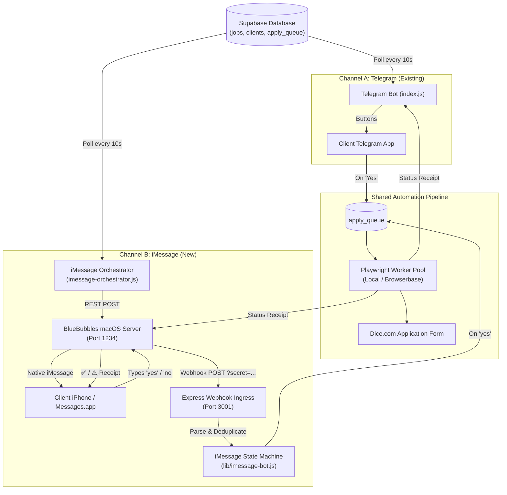
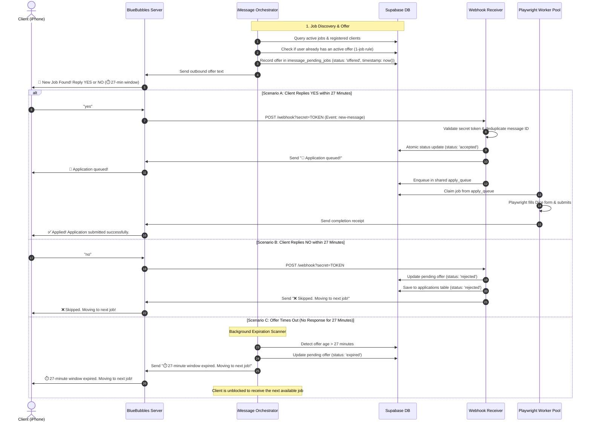

# Technical Design Document: iMessage Job Automation Channel

**Project:** `Dice_small_scale` — Automated Job Application Bot  
**Feature:** Parallel iMessage Notification & Approval Channel  
**Status:** Implementation Complete — Technical Verifications Passed (Pending Live Testing by Sharan)  

---

## 1. Executive Summary

This document outlines the architecture, data flow, and operational logic for the newly implemented **iMessage channel** within the `Dice_small_scale` automation platform. 

The iMessage channel functions as an independent, parallel notification stream alongside the existing Telegram bot:
- **Parallel Dispatch:** Active jobs posted in the database are offered simultaneously across both Telegram and iMessage.
- **Single-Job Interaction:** Each client is offered strictly one job at a time to prevent cognitive overload and notification spam.
- **Simple Response Format:** Clients respond directly via iMessage with text commands: **`yes`** / **`y`** to approve, or **`no`** / **`n`** to skip.
- **27-Minute Expiration Window:** If a client does not respond within 27 minutes, the offer expires automatically, the user is notified, and the bot advances to offer the next available job.
- **Automated Execution:** Once approved, applications are submitted automatically via Playwright browser automation on Dice.com.
- **Real-Time Receipts:** Upon completion or skip, an iMessage receipt is delivered back to the client confirming the status.

---

## 2. System Architecture

Because Apple's iMessage protocol requires native Apple hardware, **BlueBubbles Server** runs on a host Mac to interface with macOS `Messages.app`. BlueBubbles exposes a local REST API for outbound messaging and a Webhook for inbound message events.

---

## 3. End-to-End Workflow & State Machine

---

## 4. Key Engineering & Safety Protections

| Protection | Purpose & How It Works |
|---|---|
| **Webhook Security Token** | Ingress endpoints enforce token authentication (`?secret=YOUR_TOKEN`). Unauthenticated webhooks are rejected with HTTP 401. |
| **Message Deduplication** | BlueBubbles retry payloads are tracked by unique `messageGuid` in an in-memory cache (10-minute TTL) to prevent duplicate processing. |
| **Race Condition Guard** | State changes from `offered` to `accepted` use atomic database queries. If a client attempts to approve on both Telegram and iMessage simultaneously, only the first action takes effect. |
| **Single Active Offer Policy** | A client never receives multiple pending jobs at once. New job offers are held until the active offer is resolved or expires. |
| **US & Indian Phone Normalization** | A built-in phone normalizer cleans and formats numbers into strict international **E.164 format** (`+1XXXXXXXXXX` for US/Canada and `+91XXXXXXXXXX` for India). |
| **Non-Blocking Delivery** | Status receipts use fire-and-forget asynchronous promises so any BlueBubbles network hiccup will never fail a job that was already submitted on Dice. |

---

## 5. Database & State Management

State is managed via two dedicated tables in Supabase:

1. **`imessage_links`**: Maps normalized client phone numbers to internal `client_id`s. Populated automatically when a client is first messaged.
2. **`imessage_pending_jobs`**: Maintains the single active job offer per client, its creation timestamp, and current lifecycle status (`offered`, `accepted`, `rejected`, `expired`).

---

## 6. Deployment Topologies

The system is designed to support two hosting models:

* **Model 1: Co-located on Mac (Simplest)**
  Both the Node.js orchestrator and BlueBubbles run on the same macOS machine, communicating over `localhost` without external tunnels.
* **Model 2: Hybrid (Railway + Mac)**
  Node.js runs in a cloud container on Railway while BlueBubbles stays on a dedicated Mac. BlueBubbles is exposed to Railway via a secure Cloudflare Tunnel, and webhooks post directly to Railway's public domain.

---

## 7. Verification & Current Testing Status

### Technical Verifications Completed ✅
All underlying technical components and unit tests have been executed and verified:
- **Automated Test Suite:** 13/13 unit tests passed with zero failures (`test/imessage.test.js` and `test/apply-queue.test.js`).
- **Phone Normalization:** Verified across US standard, US formatted, Indian `+91`, `91...`, `0...`, and international formats.
- **Webhook Security:** Verified rejection of unauthenticated requests (HTTP 401) and acceptance of valid tokens (HTTP 200).
- **Deduplication:** Verified drop of duplicate `messageGuid` retries.
- **Queue Compatibility:** Verified that jobs without Telegram IDs execute safely through the worker pipeline.

### Operational Live Testing ⏳
- **Current Status:** Technical implementation and unit tests are complete.
- **Next Step:** End-to-end live testing with real iMessage delivery on a physical Mac environment is to be conducted and verified by **Sharan**.
